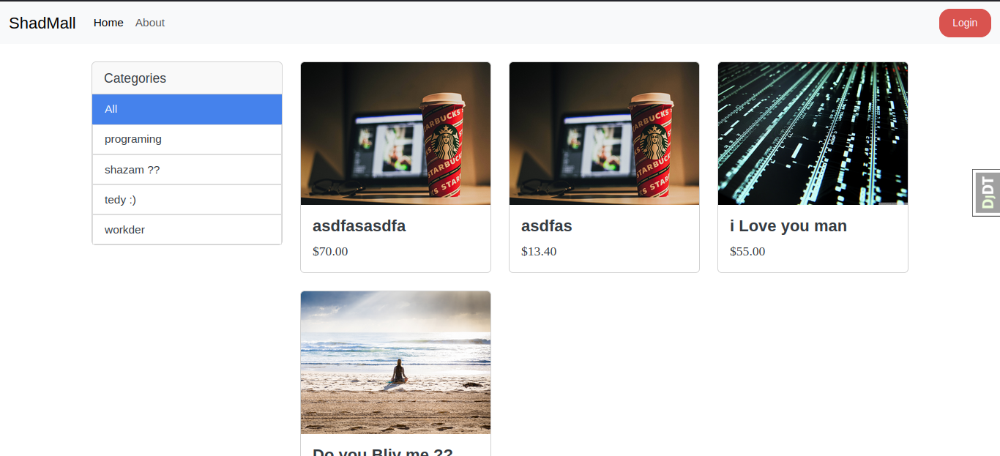
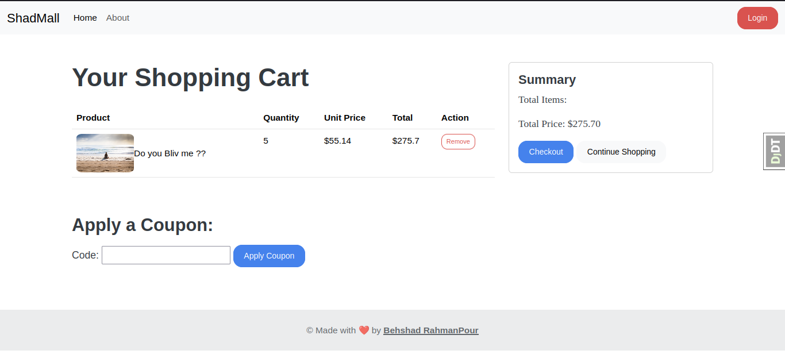
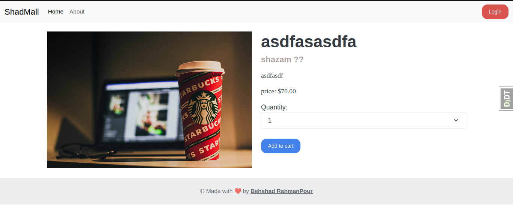
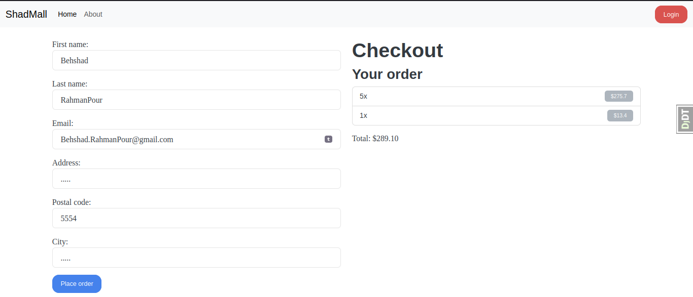

# Shadmall - Your Complete Online Store Platform

Shadmall is a comprehensive online store platform built with Django. It is equipped with essential features such as payment integration with Stripe, product categorization, and discount code functionality.

## Key Features

- **Payment Integration:** Shadmall seamlessly integrates with the Stripe payment gateway, allowing users to make secure and convenient transactions.

- **Product Categorization:** Organize your products with ease using Shadmall's intuitive product categorization system.

- **Discount Codes:** Boost your sales by offering special discounts to your customers. Shadmall supports the implementation of discount codes.

## Getting Started

To get started with Shadmall, follow these steps:

1. Install dependencies:

   ```bash
   pip install -r requirements.txt
   ```

2. Apply migrations:
   ```bash
   python manage.py migrate
   ```

3. Run the development server:
    ```bash
    python manage.py runserver
    ```

Visit http://localhost:8000 to access Shadmall locally.

## Screenshots

### Home Page


### Product Page


### Detail Page


### Order Page


## Responsive Design
Shadmall is built using Bootstrap, ensuring a responsive and user-friendly design. Whether your customers access your store from a desktop, tablet, or smartphone, Shadmall provides an optimal viewing experience.

## Contributing
If you'd like to contribute to Shadmall, please fork the repository and create a pull request. We welcome contributions from the community!

## License
This project is licensed under the MIT License - see the LICENSE.md file for details.

## Copyright

&copy; 2023 ShadMedia | All rights reserved.

This GitHub repository and its contents are the intellectual property of the ShadMedia account owner. Any unauthorized use, reproduction, or distribution of the code and assets within this repository is strictly prohibited.

For inquiries and licensing information, please contact [behshad.rahmanpour@email.com](mailto:behshad.rahmanpour@email.com).